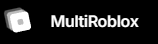
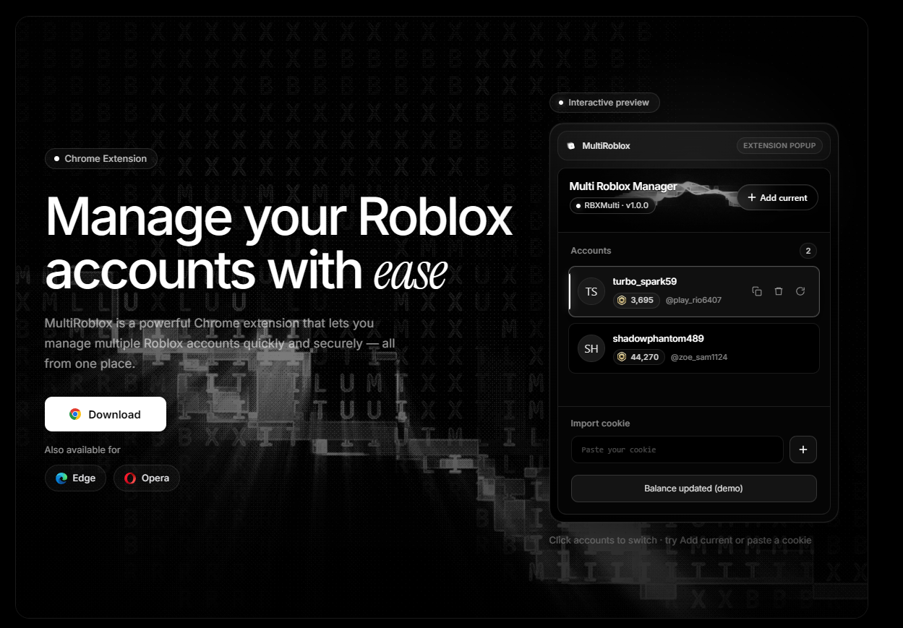
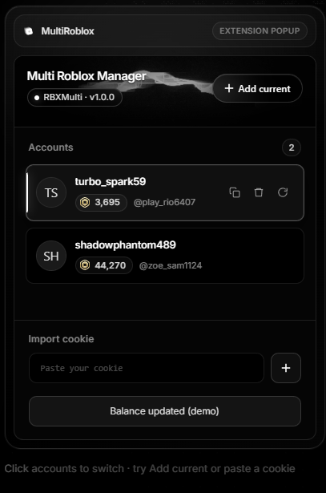

# 🚀 Multiroblox

> The ultimate browser extension for seamlessly running and managing multiple Roblox accounts on a single device at the same time.

 <!-- Replace 'assets/banner.png' with the path to your actual banner or logo image -->

**Multiroblox** is designed for active players, developers, and traders who need to operate multiple accounts simultaneously. Forget about constantly logging in and out — keep all your accounts active and monitor their key stats directly from your browser toolbar.

*Note: This repository serves as the official documentation and issue tracker for Multiroblox. The extension is closed-source and available for download on our official website.*

## 📥 Download

*(Click the button above or visit [rbxmulti.app/aiOkWapSyHg](https://rbxmulti.app/aiOkWapSyHg) to get the extension)*

## ✨ Features

* 🎭 **Multi-Instance Support:** Run several Roblox accounts simultaneously on one PC without session conflicts.
* 💰 **Robux Tracker:** Instantly view the current Robux balance for each connected profile inside the extension popup.
* 🏷️ **Quick Identification:** Easily distinguish your accounts with clearly displayed in-game nicknames.
* ⚡ **Seamless Switching:** Switch between active accounts and launch the game in just one click.
* 🔒 **Privacy Focused:** All session data is stored securely and locally in your browser.

## 📸 Screenshots

Here is a look at Multiroblox in action:

  
  &nbsp; &nbsp; &nbsp; &nbsp;
  

<!-- Replace the 'src' paths above with your actual screenshot image paths. -->

## 🛠️ How to Install

1. Visit our official website: [rbxmulti.app/aiOkWapSyHg](https://rbxmulti.app/aiOkWapSyHg)
2. Click the download button for your preferred browser.
3. Follow the quick installation steps provided on the website.

4. Pin the **Multiroblox** icon to your browser's extension bar for quick access!

## 💻 How to Use

1. Click on the **Multiroblox** icon in your browser toolbar.
2. Log in and add your Roblox accounts via the extension interface.
3. Keep track of your **Robux balance** and **Nicknames** on the main screen.
4. Click on any account to launch a new session without logging out of your main account.

## 🐛 Bug Reports & Support

If you encounter any issues, bugs, or have a feature request, please let us know! 

## ⚠️ Disclaimer

Multiroblox is a third-party browser extension and is not affiliated with, endorsed, or sponsored by Roblox Corporation.

